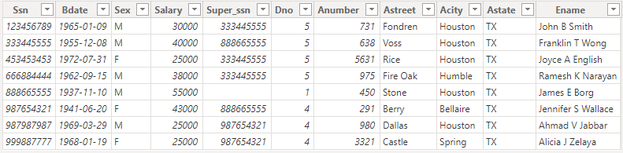
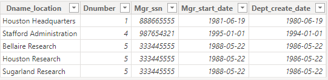

# Transformação de Dados no Power BI
## Descrição
Transformação de dados no Power BI com a base MySQL conectada do MS Azure.

## Banco de dados MySQL na Azure
Após a criação da instância na Azure para MySQL, o banco azure_company foi criado e integrado ao Power BI para recerber as transformações.

## Transformações de dados no Power BI
1. Após o carregamento dos dados as colunas de metadata foram removidas de todas as tabelas.
2. Os IDs tiveram o tipo alterado para inteiro.
3. A coluna Salary da tabela employee teve o tipo alterado para número decimal fixo, ficando de acordo com o banco.
4. O endereço da tabela employee foi separado em outras colunas: Anumber, Astreet, Acity, Astate.
   


5. Foi criada uma consulta para as tabelas employee e departament com o axílio de uma querry do banco enviada para o Power BI.
```sql
-- agrupamento da coluna employeer com departament
select concat(Fname, " ", Minit, " ", Lname) as Name, Dname as Departament from employee as e
	inner join departament as d on e.Dno = d.Dnumber;
```
6. Para a junção dos colaboradores e gerentes com seus respectivos nomes, foi criada uma consulta no Power BI com axílio de uma querry.
```sql
-- agrupamento da coluna employeer com manager
select concat(e.Fname, " ", e.Minit, " ", e.Lname) as Employeer, concat(m.Fname, " ", m.Minit, " ", m.Lname) as Manager
from employee as e
left join employee as m on e.Super_ssn = m.Ssn;
```
7. As colunas que compõem o nome do colaborador na tabela employee foram mescladas.
8. As tabelas departament e dept_locations foram unidas para posteriormente terem as colunas Dname e Dlocation mescladas. A tabela desnecessário foi removida.


